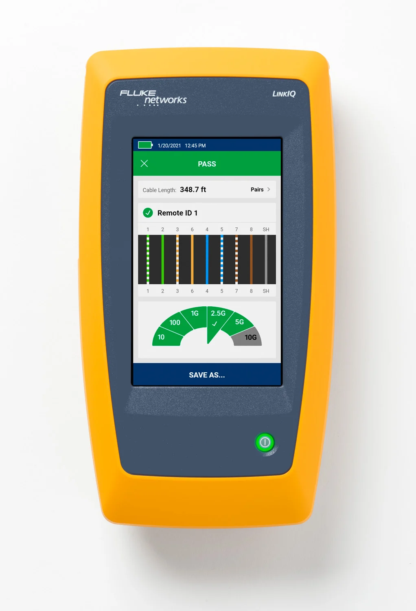

### Topics

* Troubleshooting Process
* Tools
  * Hardware
  * Software
* Techniques & Tips

## Troubleshooting Process

### It's not that different

from traditional media systems!

### Step 0: Prepare

#### Know *your* network

* DNS servers
* NTP & PTP servers
* Typical `traceroute`
* Firewalls & VLANs

### Troubleshooting Methods

:::::::::::::: {.columns}
::: {.column width="50%"}

#### CompTIA [@comptiaGuideNetworkTroubleshooting]

1. Identify the problem.
2. Develop a theory.
3. Test the theory.
4. Create an action plan.
5. Implement the solution.
6. Document the issue.

:::
::: {.column width="50%"}

#### DECSAR Method [@rossTeachingStructuredTroubleshooting2009]

1. Define the problem.
2. Examine the situation.
3. Consider the causes.
4. Consider the solution.
5. Act and test.
6. Review troubleshooting.

:::
::::::::::::::

## Hardware Tools

### Cable Testers

:::::::::::::: {.columns}
::: {.column width="50%"}

:::
::: {.column width="50%"}

:heavy_check_mark: Continuity

:heavy_check_mark: Pinout

:x: Connectivity

:x: Crosstalk, attenuation, interference...

:x: Cable break location

:::
::::::::::::::

### Network Testers

:::::::::::::: {.columns}
::: {.column width="50%"}

:::
::: {.column width="50%"}

:heavy_check_mark: Continuity

:heavy_check_mark: Pinout

:heavy_check_mark: Connectivity

:x: Crosstalk, attenuation, interference...

:x: Cable break location

:::
::::::::::::::

### Certifiers

:::::::::::::: {.columns}
::: {.column width="50%"}

:::
::: {.column width="50%"}

:heavy_check_mark: Continuity

:heavy_check_mark: Pinout

:heavy_check_mark: Connectivity

:heavy_check_mark: Crosstalk, attenuation, interference...

:x: Cable break location

:::
::::::::::::::

### TDRs & OTDRs

:::::::::::::: {.columns}
::: {.column width="50%"}

:::
::: {.column width="50%"}

:heavy_check_mark: Continuity

:heavy_check_mark: Pinout

:heavy_check_mark: Connectivity

:heavy_check_mark: Crosstalk, attenuation, interference...

:heavy_check_mark: Cable break location

:::
::::::::::::::

## References

::: {#refs}
:::
