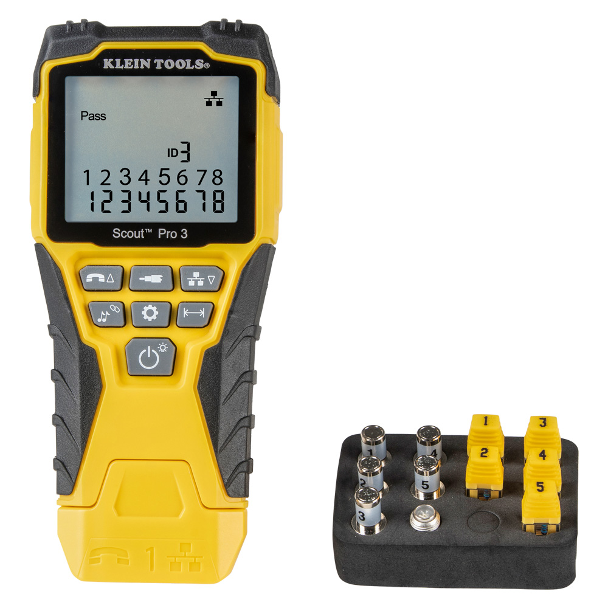

### Topics

* Troubleshooting Process
* Tools
  * Hardware
  * Software
* Techniques & Tips

## Troubleshooting Process

### It's not that different

![from traditional media systems![^credit-kozk]](images/process/robert-linder-uizuCGhJ1Rw-unsplash.jpg "TV Station KOZK control room in 1975")

[^credit-kozk]: Photo by [Robert Linder](https://unsplash.com/@rwlinder)on [Unsplash](https://unsplash.com/photos/a-desk-with-a-bunch-of-electronic-equipment-on-top-of-it-uizuCGhJ1Rw)

### Check the cable

![Network Patch Bay[^credit-cable]](images/process/jordan-harrison-40XgDxBfYXM-unsplash.jpg)

[^credit-cable]: Photo by [Jordan Harrison](https://unsplash.com/@jordanharrison) on [Unsplash](https://unsplash.com/photos/blue-utp-cord-40XgDxBfYXM)

### Step 0: Prepare

:::::::::::::: {.columns}
::: {.column width="50%"}

#### Know *your* network

* DNS servers
* NTP & PTP servers
* Typical `traceroute`
* Firewalls & VLANs
* Use DCIM & IPAM like [NetBox](https://netbox.dev/)

#### Install applications

:::
::: {.column width="50%"}

#### Bootable tool kit

[Ventoy](https://www.ventoy.net/) with:

* [Clonezilla](https://clonezilla.org/)/[Rescuezilla](https://rescuezilla.com/)
* [Gandalf’s Windows 10PE](https://www.fcportables.com/gandalf-boot-iso/)
* [MS DaRT 10](https://learn.microsoft.com/en-us/microsoft-desktop-optimization-pack/dart-v10/)
* [Memtest86](https://www.memtest86.com/)
* [Rescatux](https://www.supergrubdisk.org/rescatux/)
* [UltimateBootCD](https://www.ultimatebootcd.com/)

:::
::::::::::::::

### Practice Makes Perfect

:::::::::::::: {.columns}
::: {.column width="50%"}

* Use [GNS3](https://www.gns3.com/) or [EVE-NG](https://www.eve-ng.net/) for
hands-on lab time
* Approach from another angle:

  [J. F. Kurose and K. W. Ross, Computer
networking: A top-down approach, Eighth edition. Hoboken: Pearson,
2021.](https://gaia.cs.umass.edu/kurose_ross/index.php)

:::
::: {.column width="50%"}


:::
::::::::::::::

### Troubleshooting Methods

:::::::::::::: {.columns}
::: {.column width="50%"}

#### CompTIA [@comptiaGuideNetworkTroubleshooting]

1. Identify the problem.
2. Develop a theory.
3. Test the theory.
4. Create an action plan.
5. Implement the solution.
6. Document the issue.

:::
::: {.column width="50%"}

#### DECSAR Method [@rossTeachingStructuredTroubleshooting2009]

1. Define the problem.
2. Examine the situation.
3. Consider the causes.
4. Consider the solution.
5. Act and test.
6. Review troubleshooting.

:::
::::::::::::::

### Troubleshooting Model

``` {.mermaid width=1600}
flowchart LR
  classDef sub opacity:0
  classDef note fill:#fff, stroke:#fff, font-size:24pt

  subgraph notes [" "]
    OSI
    tcp(TCP/IP)
  end
  subgraph Check the Application
    direction TB
    Application --- Presentation --- Session
    app2[Application]
  end
  OSI -.-> Application
  tcp  -.-> app2
  Session --- Transport
  app2 --- trans2[Transport]
  app2 ~~~ Session
  subgraph Check the Protocol Stack
    direction TB
    Transport --- Network --- ll(Logical Link)
    trans2 --- Internet
    Internet --- na(Network Access)
  end
  ll --- Physical
  na --- phys2[Physical*]
  subgraph Check the Cable/NIC
    Physical
    phys2
  end
  class notes sub
  class OSI,tcp note
```

## Hardware Tools

### Cable Testers

:::::::::::::: {.columns}
::: {.column width="50%"}



:::
::: {.column width="50%"}

:heavy_check_mark: Continuity

:heavy_check_mark: Pinout

:x: Connectivity

:x: Crosstalk, attenuation, interference...

:x: Cable break location

:::
::::::::::::::

### Network Testers

:::::::::::::: {.columns}
::: {.column width="50%"}


:::
::: {.column width="50%"}

:heavy_check_mark: Continuity

:heavy_check_mark: Pinout

:heavy_check_mark: Connectivity

:x: Crosstalk, attenuation, interference...

:x: Cable break location

:::
::::::::::::::

### Certifiers

:::::::::::::: {.columns}
::: {.column width="50%"}


:::
::: {.column width="50%"}

:heavy_check_mark: Continuity

:heavy_check_mark: Pinout

:heavy_check_mark: Connectivity

:heavy_check_mark: Crosstalk, attenuation, interference...

:x: Cable break location

:::
::::::::::::::

### TDRs & OTDRs

:::::::::::::: {.columns}
::: {.column width="50%"}


:::
::: {.column width="50%"}

:heavy_check_mark: Continuity

:heavy_check_mark: Pinout

:heavy_check_mark: Connectivity

:heavy_check_mark: Crosstalk, attenuation, interference...

:heavy_check_mark: Cable break location

:::
::::::::::::::

### Other Hardware Tools

* Wire stripper
* Crimp tool
* Punch down tool
* Light meter
* Loopback adapter
* Tone generator

## Software Tools

### Check the deets

#### `ipconfig` & `netsh` (Windows)

* `/all`: Prints everything
* `/release` & `/renew`: use wildcards for interface
* `/flushdns`: Force clearing DNS cache

#### `ip` & `ifconfig` (Linux)

* `ip` combines `ifconfig` with `route` & `arp`
* `ip` has a simpler, more consistent interface [@kenlonIpVsIfconfig2023]

### Give it your best Sean Connery

#### `ping`

* Test reachability of a host
* Reports dropped packets and round trip time
* `-t` (Windows): infinite packets
* `-4`: force IPv4

#### `tracert` (Windows)/`traceroute` (Linux)

* Test each route hop to a host
* `-h` (Windows)/`-m` (Linux): max hops

### Exotic Pings

#### `pathping` (Windows)

* `ping` and `tracert` mashed together
* hop behavior over time

#### `arping` (Linux)

* Give it an IP, send an L2 ARP `who-has`
* Give it a MAC address, send an ICMP ping

### Outside Looking In

:::::::::::::: {.columns}
::: {.column width="50%"}

#### Looking Glass Servers

* [BGP](https://en.wikipedia.org/wiki/Border_Gateway_Protocol) routes, `ping`,
  & `traceroute`
* Pick your physical/network location
* Lists: [Traceroute.org](http://www.traceroute.org/),
  [LookinGlass.org](https://lookinglass.org/)
* Sites: [Hurricane Electric](https://bgp.he.net/),
  [Lumen](https://lookingglass.centurylink.com/)

:::
::: {.column width="50%"}

#### SmokePing

* Long term pings with latency
* [How to read graphs](https://oss.oetiker.ch/smokeping/doc/reading.en.html)
* External pings up to 28 days: [DSLReports](https://www.dslreports.com/smokeping)

:::
::::::::::::::

### Packet Capture

:::::::::::::: {.columns}
::: {.column width="50%"}

* [Wireshark](https://www.wireshark.org/)
* [tcpdump](https://www.tcpdump.org/) (Linux command line)
* Capture at the command line, analyze in Wireshark later
* Use capture/pcap [filters](https://www.tcpdump.org/manpages/pcap-filter.7.html)
([cheat sheet](https://packetlife.net/media/library/12/tcpdump.pdf))

:::
::: {.column width="50%"}


:::
::::::::::::::

### Packet Generators

* [PacketStorm](https://packetstorm.com/): MoIP-focused tools
* [Keysight](https://www.keysight.com/us/en/products/network-test/protocol-load-test.html)
  (formerly Ixia): :moneybag::moneybag::moneybag:
* [Ostinato](https://ostinato.org/): Build yourself or reasonably priced binaries

### Time

#### NTP

* 1, 2 with `prefer`, or 3+ servers
* Windows: Use the [Meinberg NTP port](https://www.meinbergglobal.com/english/sw/ntp.htm)
* Simple monitoring with `ntpq` or [Meinberg NTP Monitor](https://www.meinbergglobal.com/english/sw/ntp-server-monitor.htm)

#### PTP

* Monitor with [Meinberg PTP Track Hound](https://www.meinbergglobal.com/english/sw/ptp-track-hound.htm)
* Analyze with [EBU LIST](https://github.com/ebu/pi-list)

### APIs

* Use API testers like [Insomnia](https://insomnia.rest/) or [Postman](https://www.postman.com/)
* Use [OpenAPI](https://openapis.org/) descriptions or
[smithy](https://smithy.io/) contracts
  * Example: [NMOS IS-05](https://specs.amwa.tv/is-05/releases/v1.1.2/APIs/ConnectionAPI.html)
  ([source](https://github.com/AMWA-TV/is-05/blob/v1.1.x/APIs/ConnectionAPI.raml))

### NMOS

* [sdpoker](https://github.com/AMWA-TV/sdpoker) for troubleshooting SDP files
* AMWA NMOS [Testing Tool](https://specs.amwa.tv/nmos-testing/) for automated
compliance testing
* Riedel [NMOS Explorer](https://www.riedel.net/en/downloads/firmware-software)
for quick browsing devices

## References

::: {#refs}
:::
