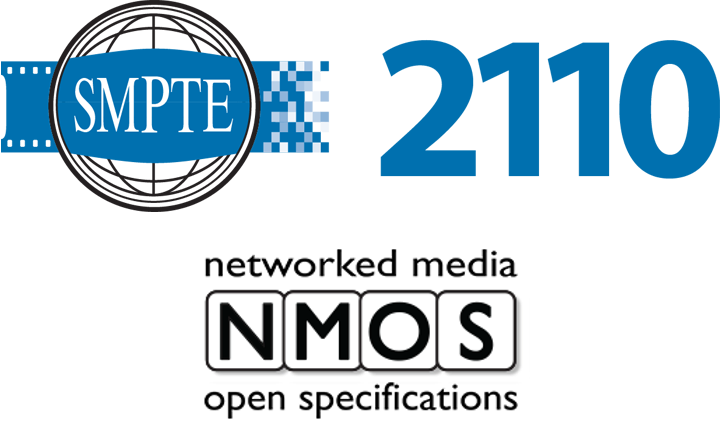

### Topics

* The Troubleshooting Process & Getting Ready
* Hardware Tools
* Software Tools

## The Troubleshooting Process & Getting Ready

### It's not that different

![from traditional media systems![^credit-kozk]](images/process/robert-linder-uizuCGhJ1Rw-unsplash.jpg "TV Station KOZK control room in 1975")

[^credit-kozk]: Photo by [Robert Linder](https://unsplash.com/@rwlinder) on [Unsplash](https://unsplash.com/photos/a-desk-with-a-bunch-of-electronic-equipment-on-top-of-it-uizuCGhJ1Rw)

### Check the cable

![Network Patch Bay[^credit-cable]](images/process/jordan-harrison-40XgDxBfYXM-unsplash.jpg)

[^credit-cable]: Photo by [Jordan Harrison](https://unsplash.com/@jordanharrison) on [Unsplash](https://unsplash.com/photos/blue-utp-cord-40XgDxBfYXM)

::: notes

It *nearly* goes without saying that when troubleshooting Media over IP systems,
you should not overlook basic checks like cables or turning software switches
on.

:::

### Step 0: Prepare

:::::::::::::: {.columns}
::: {.column width="50%"}

#### Know *your* network

* DNS servers
* NTP & PTP servers
* Typical `traceroute`
* Firewalls & VLANs
* Use DCIM & IPAM like [NetBox](https://netbox.dev/)

#### Install applications

:::
::: {.column width="50%"}

#### Bootable tool kit

[Ventoy](https://www.ventoy.net/) with:

* [Clonezilla](https://clonezilla.org/)/[Rescuezilla](https://rescuezilla.com/)
* [Gandalf’s Windows 10PE](https://www.fcportables.com/gandalf-boot-iso/)
* [MS DaRT 10](https://learn.microsoft.com/en-us/microsoft-desktop-optimization-pack/dart-v10/)
* [Memtest86](https://www.memtest86.com/)
* [Rescatux](https://www.supergrubdisk.org/rescatux/)
* [UltimateBootCD](https://www.ultimatebootcd.com/)

:::
::::::::::::::

::: notes

Before you start troubleshooting MoIP (or other) systems, you should be
prepared with the knowledge and tools for the situation.

* Know your network's DNS and time servers
* Know the usual route hops you see on your network (more on `traceroute` later)
* Know where the firewalls are and the VLAN structure
* Use a data center information management (DCIM) and IP address management
  (IPAM) system like NetBox
* Install any software you need --- and there's a *bunch* we are going to cover
  --- before you need it
* Consider preparing a USB bootable tool kit. Ventoy makes it easy to not have
  to pick one. Instead, you can fill a big thumb drive with a variety.

:::

### Practice Makes Perfect

:::::::::::::: {.columns}
::: {.column width="50%"}

* Use [GNS3](https://www.gns3.com/) or [EVE-NG](https://www.eve-ng.net/) for
hands-on lab time
* Approach from another angle:

  [J. F. Kurose and K. W. Ross, Computer
networking: A top-down approach, Eighth edition. Hoboken: Pearson,
2021.](https://gaia.cs.umass.edu/kurose_ross/index.php)

:::
::: {.column width="50%"}


:::
::::::::::::::

::: notes

Network simulators can be a little tricky to set up and resource hungry once
running, but you can get hands-on experience with major manufacturer switches in
realistic topologies.

Most network courses and texts start at the bottom of the OSI model and work
their way up. Kurose and Ross take the rare, opposite approach of starting with
the application layer and working down. This can be more relatable to new
network engineers. (Note that this most recent edition is only available as a
physical or digital rental or a digital purchase.)

:::

### Troubleshooting Methods

:::::::::::::: {.columns}
::: {.column width="50%"}

#### CompTIA [@comptiaGuideNetworkTroubleshooting]

1. Identify the problem.
2. Develop a theory.
3. Test the theory.
4. Create an action plan.
5. Implement the solution.
6. Document the issue.

:::
::: {.column width="50%"}

#### DECSAR Method [@rossTeachingStructuredTroubleshooting2009]

1. Define the problem.
2. Examine the situation.
3. Consider the causes.
4. Consider the solution.
5. Act and test.
6. Review troubleshooting.

:::
::::::::::::::

::: notes

Note that the network-specific CompTIA method is nearly identical to the generic
DECSAR method.

:::

### Troubleshooting Model

``` {.mermaid width=1600}
flowchart LR
  classDef sub opacity:0
  classDef note fill:#fff, stroke:#fff, font-size:24pt

  subgraph notes [" "]
    OSI
    tcp(TCP/IP)
  end
  subgraph Check the Application
    direction TB
    Application --- Presentation --- Session
    app2[Application]
  end
  OSI -.-> Application
  tcp  -.-> app2
  Session --- Transport
  app2 --- trans2[Transport]
  app2 ~~~ Session
  subgraph Check the Protocol Stack
    direction TB
    Transport --- Network --- ll(Logical Link)
    trans2 --- Internet
    Internet --- na(Network Access)
  end
  ll --- Physical
  na --- phys2[Physical*]
  subgraph Check the Cable/NIC
    Physical
    phys2
  end
  class notes sub
  class OSI,tcp note
```

::: notes

I find it useful to translate the formal OSI and TCP/IP models for networks into
a troubleshooting model. Think of it as translator for between what you see in
the wild and what you learn. Having the different perspectives helps with the
theorizing steps that we just looked at.

:::

## Hardware Tools

### Cable Testers

:::::::::::::: {.columns}
::: {.column width="50%"}


:::
::: {.column width="50%"}

:heavy_check_mark: Continuity

:heavy_check_mark: Pinout

:x: Connectivity

:x: Crosstalk, attenuation, interference...

:x: Cable break location

:::
::::::::::::::

::: notes

Cable testers will verify continuity on the conductors and tell you if the
pinout on both ends matches. Basic testers, like this Klein Tools, will *not*
tell you if a cable will work with certainty or at a specific speed.

:::

### Network Testers

:::::::::::::: {.columns}
::: {.column width="50%"}


:::
::: {.column width="50%"}

:heavy_check_mark: Continuity

:heavy_check_mark: Pinout

:heavy_check_mark: Connectivity

:x: Crosstalk, attenuation, interference...

:x: Cable break location

:::
::::::::::::::

::: notes

A step-up in price, network testers will actually verify connectivity and line
rate of a connection. Features vary, but most network testers don't tell you the
quality of the cable (crosstalk, attenuation, interference, etc.) or tell you
where a break in a cable is.

:::

### Certifiers

:::::::::::::: {.columns}
::: {.column width="50%"}


:::
::: {.column width="50%"}

:heavy_check_mark: Continuity

:heavy_check_mark: Pinout

:heavy_check_mark: Connectivity

:heavy_check_mark: Crosstalk, attenuation, interference...

:x: Cable break location

:::
::::::::::::::

::: notes

Cable certifiers are often a corporate purchase and bought as part of a testing
kit. There are lots of accessories and add-ons needed to cover the cable types
you want to test. Again, features vary, but certifiers will give you statistics
for the quality of a cable and features for managing bulk cable tests.

:::

### TDRs & OTDRs

:::::::::::::: {.columns}
::: {.column width="50%"}


:::
::: {.column width="50%"}

:heavy_check_mark: Continuity

:heavy_check_mark: Pinout

:heavy_check_mark: Connectivity

:heavy_check_mark: Crosstalk, attenuation, interference...

:heavy_check_mark: Cable break location

:information_source:  Have & [know how to use](https://www.bicsi.org/docs/default-source/conference-presentations/2017-winter/launch-cables.pdf?sfvrsn=b1af814c_2)
a launch fiber/box

:::
::::::::::::::

::: notes

Time domain reflectometers and their optical cousins are the ultimate physical
layer troubleshooting tool. They can help you locate cable breaks and passive
network components like patches. But they are *expensive* and make sure you have
all the accessories you need, like a launch box, before you need to use your
OTDR.

:::

### Other Hardware Tools

:::::::::::::: {.columns}
::: {.column width="50%"}

* Wire stripper
* Crimp tool
* Punch down tool
* Optical Power Meter (aka light meter)
* Loopback adapter
* Tone generator

:::
::: {.column width="50%"}


:::
::::::::::::::

::: notes

Most of the other tools you need for working on professional media networks are
probably already in your toolkit.

:::

## Software Tools

### Check the deets

#### `ipconfig` & `netsh` (Windows)

* `/all`: Prints everything
* `/release` & `/renew`: use wildcards for interface
* `/flushdns`: Force clearing DNS cache

#### `ip` & `ifconfig` (Linux)

* `ip` combines `ifconfig` with `route` & `arp`
* `ip` has a simpler, more consistent interface [@kenlonIpVsIfconfig2023]

::: notes

Unless you have a remarkable memory of a small network, you are going to want to
find out how the network is configured on a computer.

On Windows, you do that
with `ipconfig`, usually with the `/all`. That will print out the IP address,
network mask, default router, DNS servers, and more for every network interface.
You can also `/release` or `/renew` DHCP-assigned addresses, which you limit to
specific interfaces. Windows interface names are long, so wildcards save some
typing. Sometimes you need to clear the DNS cache with `/flushdns` to get a new
record that has an unexpired TTL. If you need to script setting or getting the
configuration, you can use `netsh`.

On Linux, older documentation talks about `ifconfig` (interface config) for
getting most of the same information as Windows' `ipconfig`. But newer
distributions ship with the `ip` utility. You will find it easier to use, plus
it combines information about the `arp` cache and `route` table that you need to
run separately from `ifconfig` and `ipconfig`.

:::

### Give it your best Sean Connery

:::::::::::::: {.columns}
::: {.column width="50%"}

#### `ping`

* Test reachability of a host
* Reports dropped packets and round trip time
* `-t` (Windows): infinite packets
* `-4`: force IPv4

#### `tracert` (Windows)/`traceroute` (Linux)

* Test each route hop to a host
* `-h` (Windows)/`-m` (Linux): max hops

:::
::: {.column width="50%"}


:::
::::::::::::::

::: notes

After checking the configuration of a problem computer, you will want to check
if you can reach another device. `ping` uses ICMP to send an **echo request**,
wait for an **echo reply**, and measure the round trip time. The RTT tells you
the latency of a connection. If you Captain Ramius's order and add `-t` to your
ping, you can measure RTT over time and look for intermittent dropped packets.

Each "hop" on the path between devices can be the cause of dropped packets or
high latency. `traceroute`/`tracert` manipulate the time-to-live (TTL) to ping
*router* hops one by one. Note the emphasis on routers there. You can't directly
measure the impact of any switches or other layer 2 devices with `ping` or
`traceroute`.

:::

### Exotic Pings

:::::::::::::: {.columns}
::: {.column width="50%"}

#### `pathping` (Windows)

* `ping` and `tracert` mashed together
* hop behavior over time

#### `arping` (Linux)

* Give it an IP, send an L2 ARP `who-has`
* Give it a MAC address, send an ICMP ping

:::
::: {.column width="50%"}


:::
::::::::::::::

::: notes

Sometimes `ping` and `traceroute` don't give you the clues you are looking for.
ICMP pings aren't the same as TCP or UDP. You can get `ping`-like tests with
Nmap, which we'll cover later.

On Windows, `ping` and `tracert` will give you slightly different views of the
network, so why not get the best of both worlds? PathPing gives you individual
hop statistics over a longer period of time.

Linux lets you test layer 2 connectivity with `arping`. Address Resolution
Protocol maps MAC addresses to IP addresses. Give `arping` an IP address, it
will send link layer frames to the associated MAC address and report the round
trip time. Give it a MAC address, and it will ping the resolved IP address.

:::

### Outside Looking In

:::::::::::::: {.columns}
::: {.column width="50%"}

#### Looking Glass Servers

* [BGP](https://en.wikipedia.org/wiki/Border_Gateway_Protocol) routes, `ping`,
  & `traceroute`
* Pick the physical/network location to test from
* Lists: [Traceroute.org](http://www.traceroute.org/),
  [LookinGlass.org](https://lookinglass.org/)
* Sites: [Hurricane Electric](https://bgp.he.net/),
  [Lumen](https://lookingglass.centurylink.com/)

#### SmokePing

* Long term pings with latency
* [How to read graphs](https://oss.oetiker.ch/smokeping/doc/reading.en.html)
* External pings up to 28 days: [DSLReports](https://www.dslreports.com/smokeping)
* Try [vaping](https://20c.com/project/vaping) locally
  [(Docker!)](https://github.com/20c/vaping/blob/main/docs/container.md)

:::
::: {.column width="50%"}


:::
::::::::::::::

::: notes

All the pings we've talked about so far test from a device that you control out
to another device, but sometimes you need to test from the public Internet in to
your network. Looking glass servers let you remotely run `ping` or `traceroute`
to another device. Significant connectivity providers run these servers, which
lets you choose where you test from, geographically and network
connectivity-wise. Check the server lists to find the right one to test with for
your situation.

Want to do a quick, longer term (up to about a month) test from the outside?
DSLReports still runs a SmokePing service, which does periodic packet loss and
latency tests. Check the terms of service to make sure it works for your
situation or consider setting up `vaping` for a similar self-hosted test.

:::

### Name That Computer: `dig` (Windows/Linux)

:::::::::::::: {.columns}
::: {.column width="50%"}

* Windows install: [Download](https://www.isc.org/download/) & **Tools Only** install
* Specific/all record type: `dig example.com <rrtype|ANY>`
* Specific DNS server: `@mydnsserver.example.com`
* Be brief: `+short`
* Long but readable: `+multiline +noall +answer +nocmd`
* Traceroute: `+trace`
* Interactive: omit host

:::
::: {.column width="50%"}


:::
::::::::::::::

::: notes

You will still frequently work with IP addresses, but DNS is an important part
of modern MoIP systems. You can perform basic DNS queries with `nslookup`. When
you need to look up more specialized or complex records, like NMOS can use,
you will need to `dig` for the information. With `dig` you can request all
records for a name, clearly specify the DNS server to query, format the response
for the situation, and even follow the resolution path from root server to
authoritative server.

:::

### What's This Computer Doing?

:::::::::::::: {.columns}
::: {.column width="50%"}

#### `netstat` (Windows)

* Choose protocol: `-p (tcp|udp)`
* Only listening ports: `netstat -a | find /i "listening"`
* GUI: [TCPView](https://learn.microsoft.com/en-us/sysinternals/downloads/tcpview)
  or [Resource Monitor](https://stackoverflow.com/a/23718720/6283412)

#### `ss` (Linux)

* Choose protocol: `--tcp` or `--udp`
* Only listening ports: `-l`
* [Filters](https://manpages.debian.org/bookworm/iproute2/ss.8.en.html):
  `ss -nt dst 192.0.2.0/24`

:::
::: {.column width="50%"}

![[^credit-microscope]](https://source.unsplash.com/6q5QG8iIgRo "Title: Woman looking through a microscope")

[^credit-microscope]: Photo by [Trust "Tru" Katsande](https://unsplash.com/@iamtru)
on [Unsplash](https://unsplash.com/photos/woman-looking-on-microscope-inside-room-6q5QG8iIgRo)

:::
::::::::::::::

::: notes

What a computer is (or isn't) doing on a network isn't always visible from the
applications we use. Is the server actually waiting for incoming connections?
Which server did the app actually connect to?

On Windows, the command line tool `netstat` ("network statistics") can show
incoming and outgoing connections. It can be helpful to limit the protocol to
TCP or UDP individually, since the lists get long. Printing all the listening
ports with `-l` answers that first question about waiting for incoming
connections.

For Linux, you can still use `netstat`, though the syntax is a little different
from the Windows command. The newer `ss` utility gives you more control over
that long list of connections with filters. The command above will show all TCP
connections by port number (not name) destined for the 192.0.2.0 subnet.

:::

### What's That Computer Doing?

:warning: Get permission and think about maintenance windows before using these tools!

#### Port scanning: [Nmap](https://nmap.org/)

* Scan multiple ports & addresses: `nmap -p 80,25,443,110 198.51.100.20-100`
* Service & version detection: `-sV`
* OS detection: `-O`

#### Vulnerability Scanning

* [Nessus](https://www.tenable.com/products/nessus) or [OpenVAS](https://github.com/greenbone/openvas-scanner)
* Use [the containerized build](https://greenbone.github.io/docs/latest/22.4/container/)

::: notes

Before we talk about finding out what is going on with another computer on a
network, proceed with caution. Make sure you have permission to use these tools.
If your enterprise security team is doing their job, they will know what you are
up to. Besides policy, depending on how you use these tools, they carry the risk
of causing outages. Consider running these tools during planned maintenance
windows and on offline systems.

With that out of the way, let's talk about find out what is going on with
another device, especially one you don't have the ability to work directly on.
(But you have permission to muck around, right?) You can use Nmap to scan for
open ports, those programs waiting for incoming connections. Nmap can also
guess at the specific service and version running or detect the OS of the
scanned device.

Vulnerability scanning is an essential part of security preparedness. You want
to know what your exposure is, so you can take the right mitigation steps.
The most common response is remediation, or patching the vulnerability, but you
might take other actions until you verify the patch with a vendor or test it out
yourself. Nessus and the less commercialized OpenVAS (aka Greenbone) scanners
are the most common in use. Use OpenVAS's Docker container to get up and running
fast and without unnecessary complexity.

:::

### Packet Capture

:::::::::::::: {.columns}
::: {.column width="50%"}

* [Wireshark](https://www.wireshark.org/)
* [tcpdump](https://www.tcpdump.org/) (Linux command line)
* Capture at the command line, analyze in Wireshark later
* Use capture/pcap [filters](https://www.tcpdump.org/manpages/pcap-filter.7.html)
([cheat sheet](https://packetlife.net/media/library/12/tcpdump.pdf))

:::
::: {.column width="50%"}


:::
::::::::::::::

### Packet Generators

:::::::::::::: {.columns}
::: {.column width="50%"}

* [PacketStorm](https://packetstorm.com/): MoIP-focused tools
* [Keysight](https://www.keysight.com/us/en/products/network-test/protocol-load-test.html)
  (formerly Ixia): :moneybag::moneybag::moneybag:
* [Ostinato](https://ostinato.org/): Build yourself or reasonably priced binaries

:::
::: {.column width="50%"}

![[^credit-turbine]](https://source.unsplash.com/MkKK8fH3dpA "Title: Wind turbines")

[^credit-turbine]: Photo by [Shinichiro Ichimura](https://unsplash.com/@califso)
on [Unsplash](https://unsplash.com/photos/a-row-of-wind-turbines-in-front-of-a-mountain-MkKK8fH3dpA)

:::
::::::::::::::

### Performance Benchmarking

:::::::::::::: {.columns}
::: {.column width="50%"}

#### Disk

* [IOMeter](http://www.iometer.org/): Use v1.0.1
* \# of Workers = # of Cores/vCPUs
* Work up a realistic test plan

#### Network

* [Iperf2](https://sourceforge.net/projects/iperf2/): Multicast & other media flows
* [Iperf3](https://github.com/esnet/iperf): IT workloads or public Internet

:::
::: {.column width="50%"}

![[^credit-car]](https://source.unsplash.com/bdHBAFLMMOc "Title: An analog car dashboard")

[^credit-car]: Photo by [Frankie Lopez](https://unsplash.com/@frankielopez) on [Unsplash](https://unsplash.com/photos/gray-analog-vehicle-guage-bdHBAFLMMOc)

:::
::::::::::::::

### Time

:::::::::::::: {.columns}
::: {.column width="50%"}

#### NTP

* 1, 2 with `prefer`, or 3+ servers
* Windows: Use the [Meinberg NTP port](https://www.meinbergglobal.com/english/sw/ntp.htm)
* Simple monitoring with `ntpq` or [Meinberg NTP Monitor](https://www.meinbergglobal.com/english/sw/ntp-server-monitor.htm)

#### PTP

* Monitor with [Meinberg PTP Track Hound](https://www.meinbergglobal.com/english/sw/ptp-track-hound.htm)
* Analyze with [EBU LIST](https://github.com/ebu/pi-list)

:::
::: {.column width="50%"}


:::
::::::::::::::

### APIs

:::::::::::::: {.columns}
::: {.column width="50%"}

* Use API testers like [milkman](https://github.com/warmuuh/milkman),
  [bruno](https://github.com/usebruno/bruno), and [insomnium](https://github.com/ArchGPT/insomnium)
  * Find more [Awesome API Clients](https://github.com/stepci/awesome-api-clients?tab=readme-ov-file)
* Use [OpenAPI](https://openapis.org/) descriptions or
[smithy](https://smithy.io/) contracts
  * Example: [NMOS IS-05](https://specs.amwa.tv/is-05/releases/v1.1.2/APIs/ConnectionAPI.html)
  ([source](https://github.com/AMWA-TV/is-05/blob/v1.1.x/APIs/ConnectionAPI.raml))

:::
::: {.column width="50%"}


:::
::::::::::::::

### NMOS & 2110

:::::::::::::: {.columns}
::: {.column width="50%"}

* [sdpoker](https://github.com/AMWA-TV/sdpoker) for troubleshooting SDP files
* AMWA NMOS [Testing Tool](https://specs.amwa.tv/nmos-testing/) for automated
compliance testing
* Riedel [NMOS Explorer](https://www.riedel.net/en/downloads/firmware-software)
for quick browsing devices
* [EBU LIST](https://github.com/ebu/pi-list) for timing analysis, ANC decoding,
  A/V sync, redundancy comparison, and more!

:::
::: {.column width="50%"}



:::
::::::::::::::

### Containers

:::::::::::::: {.columns}
::: {.column width="50%"}

* Understand [docker networks](https://dev.to/manojpatra1991/docker-cheat-sheet-docker-networks-49k4)
  * Don't use `bridge0`
  * Expose minimal ports with `-p`
* [netshoot](https://github.com/nicolaka/netshoot): "a Docker +
  Kubernetes network trouble-shooting swiss-army container"
* Go back to basics: [traefik/whoami](https://github.com/traefik/whoami)

:::
::: {.column width="50%"}


:::
::::::::::::::

### Keep Searching

:::::::::::::: {.columns}
::: {.column width="50%"}

* Stress test multicast with [Multicast Hammer](https://support.pelco.com/s/article/Using-Multicast-Hammer-1538586730634?language=en_US)
* Use [VLC to send RTP](https://support.adder.com/tiki/tiki-index.php?page=Network%3A%20Multicast%20test%20using%20VLC)
* Check [Awesome Real Time Communications](https://github.com/rtckit/awesome-rtc#readme)
  for SIP tools
* Find lots of [Awesome Broadcasting](https://github.com/ebu/awesome-broadcasting#readme)
  tools

:::
::: {.column width="50%"}

![[^credit-library]](https://source.unsplash.com/OG9NZVNCnFo "Title: Interior of the Vasconcelos Library in Mexico City")

[^credit-library]: Photo by [Girl with red hat](https://unsplash.com/@girlwithredhat) on [Unsplash](https://unsplash.com/photos/white-and-green-concrete-building-OG9NZVNCnFo)

:::
::::::::::::::

## References

::: {#refs}
:::
